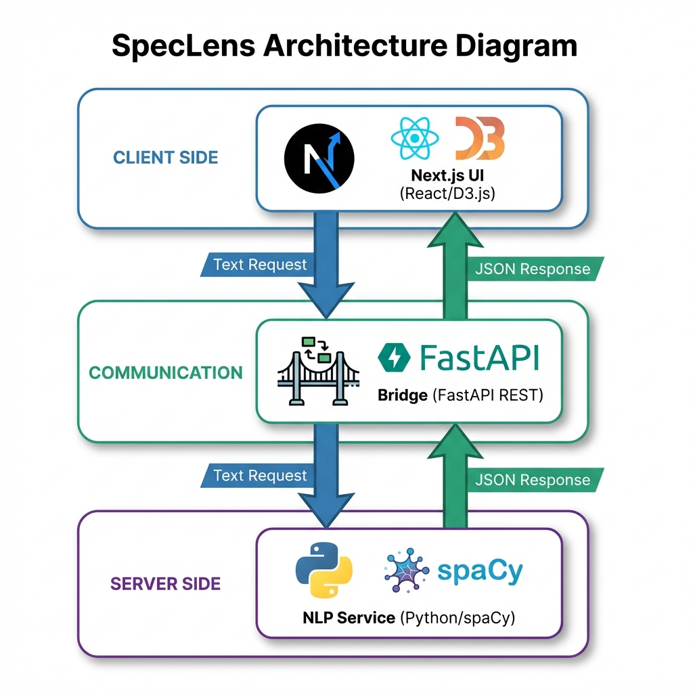
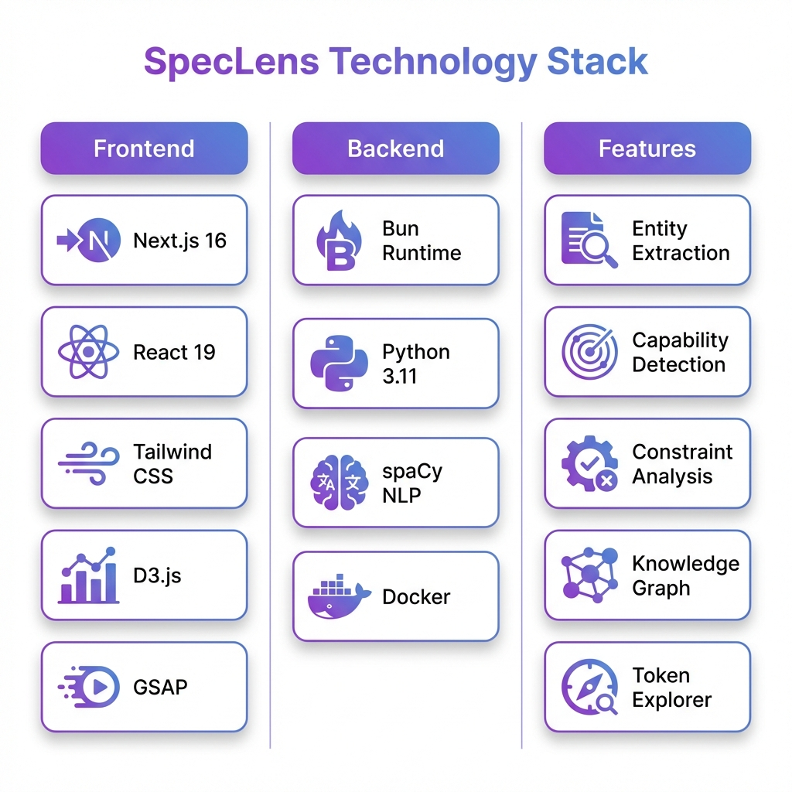

# SpecLens



## Intelligent Specification Analysis Tool

<div align="center">


</div>

**SpecLens** is a bridge between unstructured technical text and structured system understanding. It uses **spaCy** (Python) to extract entities and relationships from requirements documents, visualizing them as an interactive **2D Knowledge Graph** in Next.js.

---

## 🚀 Quick Start

Run the hybrid stack (Frontend + Backend):

```bash
# 1. Start NLP Service (Docker)
docker-compose up -d --build

# 2. Start Frontend (Bun/Node)
bun install && bun run dev
```

> **Detailed Setup**: See [GETTING_STARTED.md](./docs/GETTING_STARTED.md).

---

## 📸 Demo & Architecture

### System Architecture

*Next.js Client (UI) <-> API Bridge <-> Python NLP Service*

### Tech Stack

*The Modern Hybrid Stack: Typescript for UI, Python for Compute.*

> **Deep Dive**: See [ARCHITECTURE.md](./docs/ARCHITECTURE.md) for data flow details.

---

## ✨ Key Features

*   **🧠 Hybrid Architecture**: Best-in-class UI (React) meets Best-in-class NLP (Python).
*   **🕸️ Knowledge Graph**: Interactive D3.js visualization of system components.
*   **🔍 Tech-Specific NER**: Custom patterns to detect jargon like "Latency", "Throughput", "API".
*   **⚡ Edge-Ready**: Stateless API design suitable for Serverless deployment.

---

## 📚 Documentation

| Document | Description |
| :--- | :--- |
| [**System Architecture**](./docs/ARCHITECTURE.md) | The "Bridge" Pattern and NLP Pipeline. |
| [**Getting Started**](./docs/GETTING_STARTED.md) | Docker vs Manual Pytnon setup. |
| [**Failure Scenarios**](./docs/FAILURE_SCENARIOS.md) | Handling timeouts and large payloads. |
| [**Interview Q&A**](./docs/INTERVIEW_QA.md) | "Why spaCy instead of GPT?". |

---

## 🔧 Tech Stack

| Component | Technology | Role |
| :--- | :--- | :--- |
| **Frontend** | **Next.js 16** | Interactive UI & API Gateway. |
| **NLP Backend** | **Python (FastAPI)** | Compute-heavy analysis (spaCy). |
| **Visualization** | **D3.js** | Physics-based Graph Rendering. |
| **Runtime** | **Bun** | Ultra-fast JS runtime for dev. |

---

## 👤 Author

**Harshan Aiyappa**  
Senior Full-Stack Hybrid AI Engineer  
Voice AI • Distributed Systems • Infrastructure

[](https://kimo-nexus.vercel.app/)
[](https://github.com/Kimosabey)
[](https://linkedin.com/in/harshan-aiyappa)
[](https://x.com/HarshanAiyappa)

---

## 📝 License

This project is licensed under the MIT License - see the [LICENSE](LICENSE) file for details.
