# 🏗️ System Architecture

## 1. High-Level Design (HLD)

SpecLens is a **Hybrid NLP Architecture** that combines a high-performance Next.js frontend with a dedicated Python/NLP backend. It bridges the gap between unstructured text (Requirements Docs, PDFs) and structured system understanding (Knowledge Graphs, Dependency Trees).

```mermaid
graph TD
    User("👤 User") -->|Input Text| UI("🖥️ Next.js Client")
    UI -->|POST /analyze| Bridge("🌉 API Route (Edge)")
    Bridge -->|HTTP| NLP("🧠 Python NLP Service")
    
    subgraph "NLP Engine"
        Spacy("spaCy Pipeline")
        NER("Entity Recognition")
        POS("POS Tagging")
        Dep("Dependency Parser")
    end
    
    NLP --> Spacy
    Spacy --> NER & POS & Dep
    NLP -->|Structured JSON| UI
    
    UI -->|Render| D3("🕸️ D3.js Graph")
```



### Core Components
1.  **Frontend (Next.js 16)**: Handles user interaction, visualization (D3.js), and theme management (Cyber/Blueprint modes).
2.  **API Bridge**: Proxies requests to the backend, enabling secure communication and rate limiting.
3.  **NLP Service (Python/FastAPI)**: The computational brain. Uses `spaCy` to perform:
    *   **NER**: Identifying specialized technical entities.
    *   **Dependency Parsing**: Understanding relationships (e.g., "Login *requires* 2FA").
    *   **Vectorization**: Semantic similarity analysis.

---

## 2. Low-Level Design (LLD)

### Data Exchange Schema (JSON)
The NLP service returns a rich analysis object:

```typescript
interface AnalysisResult {
  entities: { text: string; label: string; start: number; end: number }[];
  relations: { source: string; target: string; type: "REQUIRES" | "ENABLES" | "MODIFIES" }[];
  stats: {
    tokenCount: number;
    sentenceCount: number;
    readabilityScore: number;
  };
  graph: {
    nodes: Node[];
    links: Link[];
  };
}
```

### NLP Pipeline Strategy
We use a **Rule-Based + Statistical** hybrid approach.
1.  **Statistical**: `en_core_web_sm` model identifies standard entities (Dates, Organizations).
2.  **Rule-Based**: `Matcher` patterns identify technical jargon (e.g., "API", "Latency", "Throughput") that generic models miss.

---

## 3. Decision Log

| Decision | Alternative | Reason for Choice |
| :--- | :--- | :--- |
| **Python (spaCy)** | Node.js (Compromise) | **Accuracy**. JS NLP libraries (natural, compromise) are weak compared to Python's ecosystem. Using a dedicated microservice ensures professional-grade analysis. |
| **D3.js** | Cytoscape / Recharts | **Flexibility**. Knowledge Graphs require custom physics simulations (Force Directed Graph) to detangle complex requirement structures. |
| **Bun** | Node/npm | **Speed**. Used for local development to speed up package installation and script execution. |

---

## 4. Key Patterns

### The "Bridge" Pattern
Instead of exposing the Python service directly to the public internet, we use Next.js API Routes as a **Gateway**.
*   **Security**: Hides the Python backend URL/Port.
*   **Transformation**: Allows us to formatting the JSON response before sending it to the client.

### Visualization-First Design
Technical specifications are dense. We deliberately chose **Games-like UI** (Particle effects, Glassmorphism) to make the dry task of "Requirements Analysis" engaging and cognitive-friendly.
